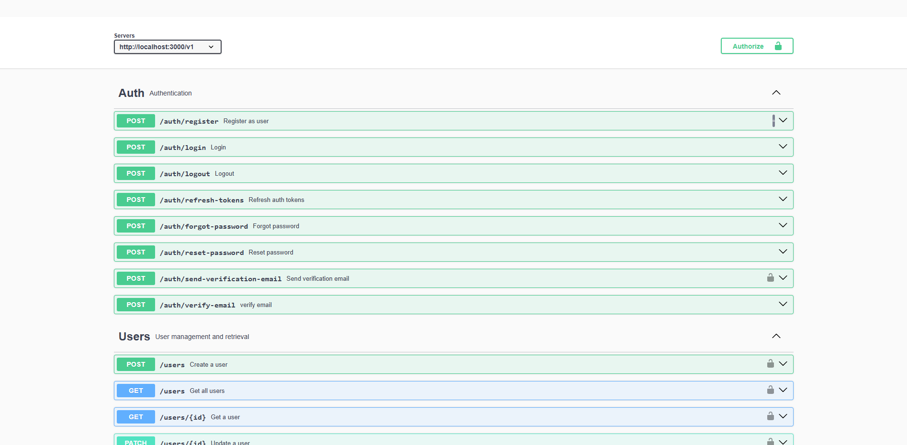
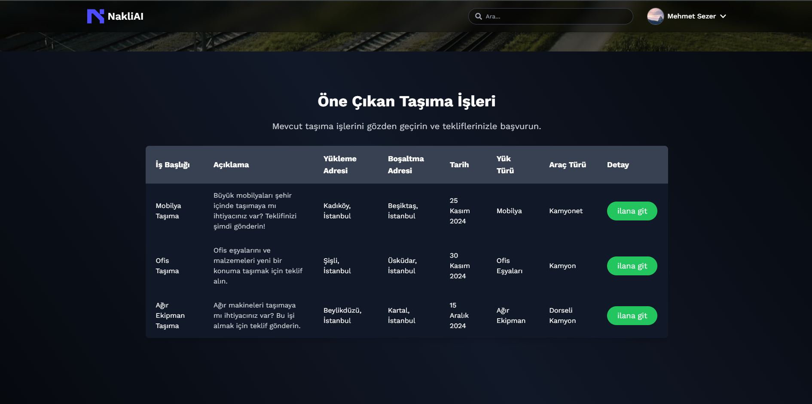

# Nakliai - Endüstri 4.0 Nakliye Pazarı

**Nakliai** , Endüstri 4.0 çerçevesinde geliştirilen yapay zeka destekli bir nakliye pazaryeri uygulamasıdır. Bu platform, lojistik ve taşımacılık sektöründe verimliliği artırmayı, maliyetleri düşürmeyi ve süreçleri optimize etmeyi hedefler.


## 🚀 Bilgisayarımda Nasıl Çalıştırırım?

### 1. Projeyi GitHub'dan klonla
```bash
git clone https://github.com/mehmetseezer/NakliAI.git
cd scout
```

### 2. Sistem Başlatma
```bash
# Tüm servisleri ayağa kaldır
docker-compose up --build -d

# Servis durumunu kontrol et
docker-compose ps
```

### 3. 3. NakliAI Veritabanını oluşturun
- **mongosh** Yüklü mü Kontrol Et
``` bash
mongosh --version
```
- MongoDB'ye bağlanın
``` bash
mongosh
```
- Veritabanlarını Listeleyin
``` bash
show dbs
```
- Nakliai Veritabanını ekleyin
``` bash
use nakliai
```


### 3. Yönetici Paneli Erişimi
URL: http://localhost:3000/v1/docs
## 🛠️ Kullanılan Teknolojiler

### İstemci (Frontend)
| Teknoloji | Açıklama     |
| :-------- | :------- |
| `React` | `Kullanıcı arayüzü oluşturmak için kullanılan modern bir JavaScript kütüphanesi` |
| `TailwindCSS` | `Hızlı ve esnek stil oluşturma için utility-first CSS frameworkü` |

### Sunucu (Backend)
| Teknoloji | Açıklama     |
| :-------- | :------- |
| `NodeJS` | `Asenkron ve event-driven mimarisiyle hızlı ve ölçeklenebilir backend uygulamaları geliştirmek için kullanılan JavaScript runtime` |

### Veritabanı ve Depolama
| Teknoloji | Açıklama     |
| :-------- | :------- |
| `MongoDB` | `NoSQL tabanlı, belge odaklı ve yüksek ölçeklenebilir veritabanı sistemi` |
| `Redis` | `Celery için task kuruğu oluşturmada kullanılan bellek için kütüphane` |

### Arama ve İndeksleme
| Teknoloji | Açıklama     |
| :-------- | :------- |
| `Elasticsearch` | `Apache Lucene üzerinde geliştirilmiş, dağıtılmış bir arama ve analiz altyapısıdır` |

### Konteynerleştirme ve Dağıtım
| Teknoloji | Açıklama     |
| :-------- | :------- |
| `Docker` | `uygulamaları konteynerler içinde paketlemek ve dağıtmak için kullanılan bir platform` |
| `Docker Compose` | ` Çoklu konteyner Docker uygulamalarını tanımlamak ve çalıştırmak için bir araç` |


### Görev Kuyrukları ve Zamanlayıcı
| Teknoloji | Açıklama     |
| :-------- | :------- |
| `Node-Cron` | `Node.js uygulamalarında zamanlanmış görevler oluşturmak için kullanılan bir kütüphane` |

### Test ve Otomasyon
| Teknoloji | Açıklama     |
| :-------- | :------- |
| `Selenium` | `Web uygulamalarını otomatik olarak test etmek için kullanılan bir araç` |

### Kimlik Doğrulama ve Yetkilendirme
| Teknoloji | Açıklama     |
| :-------- | :------- |
| `JWT (JSON Web Tokens)` | `tarafların birbirleri arasındaki veri alışverişini ve bunun doğrulamasını sağlayan JSON tabanlı RFC 7519'de tanımlanmış açık bir standarttır.` |

### Makine Öğrenimi
| Teknoloji | Açıklama     |
| :-------- | :------- |
| `Scikit-learn` | `Python'da makine öğrenimi modelleri oluşturmak ve eğitmek için kullanılan bir kütüphane` |

## ⚡ API Kullanımı

Scout platformu, Medium kullanıcı ve blog verilerine erişim sağlayan RESTful API'ler sunar. Tüm endpoint'ler JWT tabanlı kimlik doğrulama gerektirir.

---

### 🔐 Kimlik Doğrulama

#### Giriş Yapma
```http
POST /api/v1/auth/login
Content-Type: application/json
```
| Parametre | Tip     | Açıklama                |
| :-------- | :------- | :------------------------- |
| `email` | `string` | **Gerekli**. Kullanıcı Adı |
| `password` | `string` | **Gerekli**. Parola |

#### Respone
```json
{
  "user": {
    "id": "12345",
    "email": "user@example.com",
    "name": "John Doe"
  },
  "tokens": {
    "access": {
      "token": "access-token",
      "expires": "2023-12-31T23:59:59Z"
    },
    "refresh": {
      "token": "refresh-token",
      "expires": "2024-01-31T23:59:59Z"
    }
  }
}
```

#### Çıkış Yapma
```http
POST /api/v1/auth/logout
Content-Type: application/json
```
| Parametre | Tip     | Açıklama                |
| :-------- | :------- | :------------------------- |
| `refreshToken` | `string` | **Gerekli**. Yenileme tokenı |

#### Respone
```json
{
  "message": "Logged out successfully"
}
```

#### Token Yenileme
```http
POST /api/v1/auth/refresh-tokens
Content-Type: application/json

```

| Parametre | Tip     | Açıklama                |
| :-------- | :------- | :------------------------- |
| `refresh` | `string` | **Gerekli**. Yenileme tokenı |

#### Respone
```json
{
  "access": {
    "token": "new-access-token",
    "expires": "2023-12-31T23:59:59Z"
  },
  "refresh": {
    "token": "new-refresh-token",
    "expires": "2024-01-31T23:59:59Z"
  }
}
```

### 👤 Kullanıcı İşlemleri
#### Kullanıcı Kaydı (Register)
```http
POST /api/v1/users
```

| Parametre | Tip     | Açıklama                |
| :-------- | :------- | :------------------------- |
| `name` | `string` | **Gerekli**. Kullanıcı ismi |
| `email` | `string` | **Gerekli**. Kullanıcı emaili |
| `password` | `string` | **Gerekli**. Kullanıcı parolası |
| `phone` | `string` | **Gerekli**. Kullanıcı telefon numarası |

#### Respone
```json
{
    "message": "Successfully registered"
}
```
#### Kullanıcı Listesi
```http
GET /api/users/{username}/
Authorization: Bearer <access_token>
```
| Parametre | Tip     | Açıklama                |
| :-------- | :------- | :------------------------- |
| `username` | `string` | **Gerekli**. aranacak kullanıcı adı |

#### Respone
```json
{
  "username": "kemal",
  "name": "Kemal Sunal",
  "followers": 15000,
  "last_post_date": "2023-10-15",
  "total_read_time": 1200
}
```
### 📝 Blog İşlemleri
#### Blog Arama
```http
GET /api/blogs/?q=django&author=kemal&min_read_time=5&max_read_time=35&page=1
Authorization: Bearer <access_token>
```
| Parametre | Tip     | Açıklama                |
| :-------- | :------- | :------------------------- |
| `q` | `string` | aranacak sorgu kelimesi |
| `author` | `string` | aranacak yazar |
| `min_read_time` | `integer` | en az okuma süresi (dakika) |
| `max_read_time` | `integer` | en fazla okuma süresi (dakika) |
| `page` | `integer` | [Pagination] sayfa numarası |

#### Respone
```json
{
  "count": 15,
  "results": [
    {
      "title": "Django ile Yüksek Performans",
      "author": "kemal",
      "date": "2023-10-01",
      "read_time": 8,
      "content_preview": "Django ORM optimizasyon teknikleri..."
    }
  ]
}
```

#### Blog Detayı
```http
GET /api/blogs/{id}/
Authorization: Bearer <access_token>
```
| Parametre | Tip     | Açıklama                |
| :-------- | :------- | :------------------------- |
| `id` | `string` | **Gerekli**. aranacak blog idsi |

#### Respone
```json
{
  "title": "Django ile Yüksek Performans",
  "author": {
    "username": "kemal",
    "name": "Kemal Sunal"
  },
  "content": "Django ORM optimizasyon teknikleri...",
  "date": "2023-10-01T12:00:00Z",
  "read_time": 8,
  "tags": ["django", "optimization"]
}
```
## 🎨 Renk Referansları

Nakliai projesinde kullanılan renk paleti, kullanıcı deneyimini geliştirmek ve tutarlı bir tasarım dili oluşturmak için özenle seçilmiştir. Aşağıda projede kullanılan renkler ve kullanım alanları listelenmiştir:

---

### 🖌️ Renk Paleti

| Renk Kodu       | Kullanım Alanı                          | Açıklama                                  |
|-----------------|-----------------------------------------|------------------------------------------|
| `##000000`       | Arka Plan (Siyah)           | Ana arka plan rengi, minimalist tasarım içiniçin  |
| `#1a1a1a`       | Arka Plan (Koyu Gri)                          | 	İkincil arka plan rengibaşlıklar için         |
| `#ffffff`       |	Metin (Beyaz)                      | 	Ana metin rengi, okunabilirlik içiniçin        |
| `#38B2AC`          | Butonlar (Turkuaz)          | Butonlar ve etkileşimli öğeler içiniçin              |
| `#2C7A7B`       | Butonlar (Hover Durumu)   | Buton hover rengi          |
| `#4A5568`       | Tablo Başlıkları                                 | Tablo başlıkları ve vurgu alanları için|
| `#2D3748`       | Tablo Satırları (Hover)                      | Tablo satırlarının hover rengi|
| `#718096`       | İkincil Metinler                | Açıklama metinleri ve ikincil içerikleriçin              |
| `#E2E8F0`       | Kenarlık ve Ayırıcılar          |Kenarlık ve ayırıcı çizgiler için için         |
| `#48BB78`       | Başarı Mesajları         | Başarı durumlarında kullanılan renk                  |
| `#F56565`       | Hata Mesajları       |	Hata durumlarında kullanılan renk                  |
---

### 🎯 Renk Kullanımı

1. **Arka Planlar**  
   - `#000000`, `#1a1a1a` renkleri başlıklarda hiyerarşi oluşturmak için kullanılır.
   - Koyu tonlar, içeriğin önemini vurgular.

2. **Metinler (Paragraflar, Listeler)**  
   - `#ffffff` rengi, okunabilirliği artırmak için ana metinlerde kullanılır.
   - `#718096` rengi, italik metinler ve resim alt yazıları gibi ikincil içerikler için tercih edilir.

3. **Linkler**  
   - `#38B2AC` rengi, linkler için kullanılır ve hover durumunda `#2C7A7B` rengine dönüşür.
   - Bu renkler, kullanıcı etkileşimini artırmak için seçilmiştir.

4. **Tablolar**  
   - `#4A5568` rengi, tablo başlıkları ve vurgu alanları için kullanılır..
   - `#2D3748`  rengi, tablo satırlarının hover durumunda kullanılır.

5. **KKenarlık ve Ayırıcılar**  
   - `#E2E8F0` rengi, kenarlık ve ayırıcı çizgiler için kullanılır.

6. **Durum Mesajları**  
   - `#48BB78` rengi, başarı mesajları için kullanılır.
   - `#F56565` rengi, hata mesajları için kullanılır.

---

### 🖼️ Renk Uyumu

Bu renk paleti, koyu temalı bir tasarım dilini destekler. Siyah ve gri tonları, modern ve profesyonel bir görünüm sağlarken, turkuaz ve yeşil tonları etkileşimi artırır. Renkler, birbiriyle uyumlu ve göz yormayan bir kombinasyon oluşturur.

---

### 🎨 Renk Örnekleri

```html
<div style="background-color: #000000; color: #ffffff;">
  <h1>Ana Başlık</h1>
  <p>Bu bir paragraf metnidir.</p>
</div>

<button style="background-color: #38B2AC; color: #ffffff;">Buton</button>

<table>
  <thead style="background-color: #4A5568; color: #ffffff;">
    <tr>
      <th>Başlık 1</th>
      <th>Başlık 2</th>
    </tr>
  </thead>
  <tbody>
    <tr style="background-color: #2D3748; color: #ffffff;">
      <td>Satır 1</td>
      <td>Satır 2</td>
    </tr>
  </tbody>
</table>

<div style="border: 1px solid #E2E8F0;">
  <p>Kenarlıklı Kutu</p>
</div>

<div style="color: #48BB78;">Başarı Mesajı</div>
<div style="color: #F56565;">Hata Mesajı</div>
```

---

## 📸 Ekran Görüntüleri

| Admin Paneli | Arama Sonuçları |
|--------------|-----------------|
|  |  |

---
## 🧠 Kazanımlar
### 🐳 Docker
Multi-Container Uygulama Yönetimi: Docker Compose ile mikroservis mimarisini öğrendim. Farklı servislerin bir arada nasıl çalıştırılacağını ve yönetileceğini deneyimledim.

Healthcheck ve Dependency Management: Servislerin sağlık durumunu izleme ve bağımlılık yönetimi konularında bilgi sahibi oldum.

Volume Kullanımı: Veri kalıcılığı için volume'lerin nasıl kullanılacağını öğrendim ve uyguladım.

### 🕒 Node-cron
Scheduled Tasks: Zamanlanmış görevler oluşturmayı ve yönetmeyi öğrendim.

Task Automation: Tekrarlayan görevleri otomatikleştirmeyi öğrendim.

### 🔍 Elasticsearch
Full-Text Search: Türkçe dil desteği ile arama optimizasyonu.

Index Management: Veri indexleme ve yönetimi.

Bulk API: Toplu veri işleme ve performans artışı.

### 🧠 Redis
Cache Management: Veri önbellekleme ve performans artışı.

Pub/Sub Pattern: Gerçek zamanlı mesajlaşma ve event-driven mimari.

Atomic Operations: Thread-safe operasyonlar ve veri tutarlılığı.

### ⚛️ React.js
Component-Based Architecture: Bileşen tabanlı mimari ile modüler ve yeniden kullanılabilir kod yazmayı öğrendim.

State Management: Context API ve Redux gibi araçlarla state yönetimini öğrendim.

Hooks: React Hooks ile fonksiyonel bileşenlerde state ve lifecycle yönetimini öğrendim.

### 🎨 TailwindCSS
Utility-First CSS: Utility-first yaklaşımı ile hızlı ve esnek stil oluşturmayı öğrendim.

Responsive Design: Responsive tasarım için TailwindCSS'in sunduğu kolaylıkları deneyimledim.

Customization: TailwindCSS yapılandırmasını özelleştirerek projeye özgü stil sistemleri oluşturmayı öğrendim.

### 🐍 Scikit-learn
Machine Learning Models: Temel makine öğrenimi modellerini uygulamayı ve eğitmeyi öğrendim.

Data Preprocessing: Veri ön işleme tekniklerini ve Scikit-learn ile nasıl uygulanacağını öğrendim.

Model Evaluation: Model performansını değerlendirme metriklerini öğrendim.

### 🧪 Selenium
Automated Testing: Web uygulamalarını otomatik olarak test etmeyi öğrendim.

Cross-Browser Testing: Farklı tarayıcılarda test senaryolarını çalıştırmayı öğrendim.

### 🍃 MongoDB
NoSQL Database Management: NoSQL veritabanı yönetimi ve sorgulama tekniklerini öğrendim.

Schema Design: Esnek şema tasarımı ve veri modelleme konularında deneyim kazandım.

Aggregation Framework: MongoDB Aggregation Framework ile karmaşık sorgular yazmayı öğrendim.
## 📬 Geri Bildirim ve İletişim

Scout projesiyle ilgili geri bildirimlerinizi, önerilerinizi veya sorularınızı aşağıdaki e-posta adresi üzerinden iletebilirsiniz. Geliştirme sürecinde kullanıcı geri bildirimleri bizim için çok değerlidir!

**İletişim Bilgileri:**  
📧 E-posta: [mehmetszr05@gmail.com](mailto:mehmetszr05@gmail.com)  

Geri bildirimlerinizi bekliyoruz! 🚀